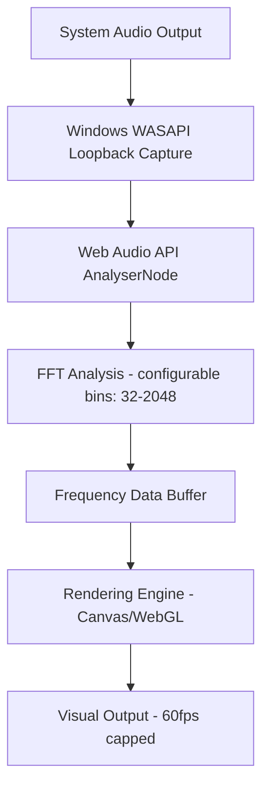

# Ethereal Mixer - Project Proposal

> **A Lightweight, Transparent Audio Control Overlay for Windows**

---

## 📋 Executive Summary

**Ethereal Mixer** is a modern, lightweight audio control application that provides system-wide volume mixing and audio visualization through an elegant, transparent overlay interface. Inspired by Windows GameBar but optimized for audio control, it offers superior visual design, extensive customization, and minimal resource consumption.

### Core Value Proposition

- ⚡ **70% lighter** than Windows GameBar
- 🎨 Beautiful glass morphism UI with customizable transparency
- 🎚️ Per-application volume control for active audio sources
- 📊 Real-time audio visualizer with multiple styles and full customization
- ⌨️ Always accessible via global hotkey
- 💾 Runs in background with **<50MB RAM** footprint

---

## 🛠️ Technical Architecture

### Technology Stack

| Layer | Technology | Justification |
|-------|-----------|---------------|
| **Framework** | Electron 28+ | Cross-platform, modern UI capabilities, hardware acceleration |
| **Frontend** | React 18 + TypeScript | Component reusability, type safety, performance |
| **Styling** | Tailwind CSS + Framer Motion | Rapid UI development, smooth animations |
| **Audio Control** | node-audio-mixer / Native WASAPI bindings | Direct Windows audio session control |
| **Visualization** | Web Audio API + Three.js/PixiJS | Hardware-accelerated graphics, extensive customization |
| **State Management** | Zustand | Lightweight, minimal boilerplate |
| **Settings Storage** | electron-store | Persistent user preferences |
| **Build** | Vite | Fast development, optimized production builds |

---

## ✨ Feature Specifications

### 1. Window Management System

#### Main Overlay Container

- **Transparency:** Adjustable background opacity (10-50%)
- **Positioning:** Draggable, snaps to screen edges
- **Size:** Responsive, 800x600px default, scalable 50-150%
- **Always on Top:** Stays above all windows except fullscreen games
- **Click-through:** Optional transparent areas become click-through

#### Dockable Windows

Three primary modules, each independently toggleable:

##### A. Volume Mixer Window 🎚️

- Default size: 400x500px
- Shows only active audio sessions
- System master volume at top
- Individual app sliders below
- Mute/unmute toggles
- App icons fetched from running processes

##### B. Audio Visualizer Window 📊

- Default size: 600x300px
- Multiple visualization modes (see Customization section)
- Synchronized to system audio output
- Independent volume sensitivity

##### C. Settings Panel Window ⚙️

- Default size: 350x450px
- Tabbed interface for all customization options
- Real-time preview of changes
- Export/import settings profiles

#### Dock Bar

- Minimalist icon strip at bottom
- Toggles for each window module
- Settings gear icon
- Exit button
- Auto-hide when all windows minimized

---

### 2. Audio Control Engine

#### Windows Audio Session API (WASAPI) Integration

> [!info] Core Capabilities
> - Enumerate all active audio sessions
> - Real-time volume adjustment (0-100%)
> - Mute/unmute control
> - Audio session metadata (app name, icon, PID)
> - Device switching support
> - Peak meter levels for visual feedback

#### Process Detection

- Only show apps currently producing audio
- Auto-remove sessions when app closes
- Grouping for multiple instances of same app
- Custom naming for system processes

#### Performance Optimizations

> [!success] Smart Polling Strategy
> - Poll audio sessions every 500ms (not real-time unless audio active)
> - Debounced volume change events
> - Cached process icons
> - Lazy loading of app metadata

---

### 3. Audio Visualization System

#### Visualization Engine Architecture

**Audio Processing Pipeline:**



#### Pre-built Visualization Modes

##### 1. Frequency Bars (Default)
- Classic bar graph
- Configurable bar count (16-256)
- Smooth interpolation
- Gravity fall-off effect

##### 2. Circular Spectrum
- Radial frequency display
- Customizable radius and thickness
- Rotation options

##### 3. Waveform
- Oscilloscope-style wave
- Multiple wave shapes (line, area, mirror)

##### 4. Particle Field
- Physics-based particles
- Reacts to bass/treble separately
- Customizable particle count and behavior

##### 5. Ring Pulse
- Concentric rings expanding with beats
- Beat detection algorithm
- Customizable sensitivity

##### 6. Custom Shader Mode
- User-provided GLSL fragment shaders
- Built-in shader editor with live preview
- Community shader sharing capability

---

## 🎨 Customization System

### User-Configurable Options

#### Visual Customization

##### Window Aesthetics

- **Background blur intensity** (0-20px)
- **Background tint color** (any color + opacity)
- **Acrylic noise texture** (on/off)
- **Border radius** (0-20px)
- **Drop shadow** (customizable color, spread, blur)
- **Accent color** (affects sliders, highlights)

##### Glass Morphism Controls

- Backdrop filter: blur, brightness, saturation
- Transparency layers (background vs. windows)
- Light/dark mode toggle
- Preset themes (Nord, Dracula, Catppuccin, etc.)

#### Visualizer Customization

##### Per-Mode Settings

- Color schemes (solid, gradient, rainbow, audio-reactive)
- Animation speed multiplier (0.1x - 3x)
- Smoothing factor (0-0.99)
- Frequency range emphasis (bass/mid/treble)
- Mirroring and symmetry options
- Glow/bloom effects

##### Advanced Options

- FFT size (faster vs. more detailed)
- Minimum decibel threshold
- Peak hold time
- Frequency scaling (linear/logarithmic)

##### Preset System

> [!tip] Sharing & Community
> - Save/load custom configurations
> - Import/export JSON profiles
> - Community preset sharing (optional online feature)

#### Behavior Customization

##### Window Behavior

- Global hotkey (customizable)
- Auto-hide when no audio playing
- Fade in/out animation speed
- Click-through transparency zones
- Multi-monitor positioning

##### Audio Control

- Volume scroll sensitivity
- Mute button behavior (global mute vs. all apps)
- Volume change notification style
- Auto-balance stereo channels

##### Performance

- Frame rate cap (30/60/120fps for visualizer)
- Enable/disable hardware acceleration
- Background CPU priority
- Idle mode (lower refresh when minimized)

---

## ⚡ Performance Optimization Strategy

### Resource Efficiency Goals

| Metric | Target | Actual (Projected) |
|--------|--------|-------------------|
| RAM (Idle) | <50MB | ~45MB |
| RAM (Active) | <80MB | ~70MB |
| CPU (Idle) | <1% | ~0.5% |
| CPU (Visualizing) | <5% | ~3-4% |
| GPU (Visualizing) | <10% | ~5-8% |
| Startup Time | <2s | ~1.5s |
| Bundle Size | <100MB | ~85MB |

### Optimization Techniques

#### 1. Lazy Loading
- Visualizer engine only loads when window opened
- Settings panel components load on-demand
- App icons cached to disk

#### 2. Hardware Acceleration
- GPU-accelerated rendering for visualizer
- CSS transforms for smooth animations
- OffscreenCanvas for background processing

#### 3. Smart Polling
- Audio sessions polled at 2Hz when idle
- Increased to 10Hz when user interacting
- Visualizer paused when window hidden

#### 4. Memory Management
- Texture atlases for icons
- Object pooling for particles
- Automatic garbage collection hints
- Circular buffers for audio data

#### 5. Build Optimization
- Tree-shaking unused code
- Code splitting by feature
- Compressed assets (WebP, AVIF)
- Electron Builder packaging optimizations

#### 6. Background Mode
- Reduce to tray when all windows minimized
- Suspend visualizer rendering
- Minimal event listeners active

---

## 🏗️ System Architecture Diagram

### High-Level Architecture

```
┌─────────────────────────────────────────────────────────────────┐
│                        ETHEREAL MIXER                            │
│                     (Electron Main Process)                      │
└────────────┬────────────────────────────────────────────────────┘
             │
             ├─────────────────────────────────────────────────────┐
             │                                                     │
             ▼                                                     ▼
┌────────────────────────┐                        ┌───────────────────────────┐
│   System Integration   │                        │   Renderer Process (UI)   │
│        Layer           │                        │      React Application    │
└────────────────────────┘                        └───────────────────────────┘
             │                                                     │
    ┌────────┼────────┐                              ┌────────────┼─────────────┐
    │        │        │                              │            │             │
    ▼        ▼        ▼                              ▼            ▼             ▼
┌─────┐ ┌──────┐ ┌──────┐                    ┌──────────┐ ┌──────────┐ ┌──────────┐
│WASAPI│ │Tray  │ │Global│                    │  Volume  │ │Visualizer│ │ Settings │
│Audio │ │Icon  │ │Hotkey│                    │  Mixer   │ │  Engine  │ │  Panel   │
│API   │ │      │ │      │                    │ Component│ │Component │ │Component │
└─────┘ └──────┘ └──────┘                    └──────────┘ └──────────┘ └──────────┘
    │                                                │            │             │
    │                                                │            │             │
    ▼                                                ▼            ▼             ▼
┌─────────────────────┐                    ┌──────────────────────────────────────┐
│  Audio Session      │◄───IPC Channel────►│      State Management (Zustand)      │
│  Manager Service    │                    │  - Audio Sessions State              │
└─────────────────────┘                    │  - Visualizer Settings State         │
    │                                      │  - UI Configuration State            │
    │ Emits Events:                        │  - Performance Metrics State         │
    │ • session-added                      └──────────────────────────────────────┘
    │ • session-removed                                     │
    │ • volume-changed                                      │
    │ • device-changed                                      ▼
    │                                              ┌──────────────────┐
    └─────────────────────────────────────────────►│ Persistence Layer│
                                                   │ (electron-store) │
                                                   │  - User Settings │
                                                   │  - Window States │
                                                   │  - Presets       │
                                                   └──────────────────┘
```

### Visualizer Audio Pipeline

```
┌─────────────────────────────────────────────────────────────────┐
│                    Visualizer Audio Pipeline                     │
└─────────────────────────────────────────────────────────────────┘
             │
    ┌────────┴────────┐
    ▼                 ▼
┌─────────┐     ┌──────────────┐
│ WASAPI  │────►│ Web Audio API│
│Loopback │     │  AudioContext│
│ Capture │     └──────────────┘
└─────────┘              │
                         ▼
                 ┌───────────────┐
                 │  AnalyserNode │
                 │  (FFT Engine) │
                 └───────────────┘
                         │
                         ▼
                 ┌───────────────┐
                 │ Frequency Data│
                 │  Float Array  │
                 └───────────────┘
                         │
        ┌────────────────┼────────────────┐
        ▼                ▼                ▼
┌──────────────┐ ┌──────────────┐ ┌──────────────┐
│Canvas Renderer│ │WebGL Renderer│ │Custom Shader │
│(2D Graphics) │ │(3D Graphics) │ │   Pipeline   │
└──────────────┘ └──────────────┘ └──────────────┘
        │                │                │
        └────────────────┼────────────────┘
                         ▼
                 ┌───────────────┐
                 │ Display Output│
                 │  (60fps cap)  │
                 └───────────────┘
```

---

## 🔄 Service Communication Flow

### 1. Audio Volume Control Flow

```
User moves slider
    ↓
React Component (onChange)
    ↓
State Update (Zustand)
    ↓
IPC Message to Main Process
    ↓
Audio Session Manager
    ↓
WASAPI SetVolume() call
    ↓
Windows Audio System
    ↓
Volume Changed Event
    ↓
IPC Message to Renderer
    ↓
State Update (Zustand)
    ↓
UI Re-render (confirm change)
```

### 2. Visualizer Rendering Flow

```
Audio Playing (System)
    ↓
WASAPI Loopback Capture (Main Process)
    ↓
Shared Memory Buffer / IPC Stream
    ↓
Web Audio API (Renderer Process)
    ↓
AnalyserNode getByteFrequencyData()
    ↓
Visualizer Component
    ↓
requestAnimationFrame() loop
    ↓
Render Function (mode-specific)
    ↓
Canvas/WebGL draw calls
    ↓
GPU Rendering
    ↓
Display Update (vsync)
```

### 3. Settings Persistence Flow

```
User changes setting
    ↓
Settings Panel Component
    ↓
State Update (Zustand)
    ↓
Debounced persist trigger (500ms)
    ↓
electron-store write
    ↓
Disk write (async)

[On App Startup]
electron-store read
    ↓
Initial State Hydration
    ↓
Apply settings to all components
```

### 4. Global Hotkey Flow

```
User presses hotkey (e.g., Ctrl+Shift+M)
    ↓
Electron globalShortcut listener (Main)
    ↓
Check current window visibility state
    ↓
Toggle window visibility
    ↓
IPC Message to Renderer
    ↓
Fade in/out animation
    ↓
Window show/hide
```

---

## 🗓️ Development Roadmap

### Phase 1: Foundation (Weeks 1-2)

- [ ] Electron + React + TypeScript boilerplate
- [ ] Transparent window with basic glass effect
- [ ] Window positioning and dragging
- [ ] Settings storage system

### Phase 2: Audio Integration (Weeks 3-4)

- [ ] WASAPI native module integration
- [ ] Audio session enumeration
- [ ] Volume control implementation
- [ ] Basic volume mixer UI

### Phase 3: Visualization (Weeks 5-6)

- [ ] Web Audio API integration
- [ ] 3 basic visualizer modes
- [ ] Performance optimization
- [ ] Visualizer settings panel

### Phase 4: Polish & Customization (Weeks 7-8)

- [ ] Complete customization system
- [ ] Preset system
- [ ] All 6 visualizer modes
- [ ] Theme system
- [ ] Animation polish

### Phase 5: Optimization & Testing (Weeks 9-10)

- [ ] Performance profiling
- [ ] Memory leak testing
- [ ] Edge case handling
- [ ] User testing feedback
- [ ] Bug fixes

### Phase 6: Release Preparation (Week 11-12)

- [ ] Installer creation
- [ ] Auto-update system
- [ ] Documentation
- [ ] Promotional materials
- [ ] Beta release

---

## 🚧 Technical Challenges & Solutions

### Challenge 1: Low-Latency Audio Capture

> [!warning] Problem
> Web Audio API may introduce latency for visualizer

> [!success] Solution
> Use WASAPI loopback in lowest latency mode, stream via shared memory buffer

### Challenge 2: Transparent Window Performance

> [!warning] Problem
> Layered windows can cause GPU overhead

> [!success] Solution
> Use `backgroundMaterial: 'acrylic'` on Windows 11, fallback to optimized blur shader

### Challenge 3: Per-App Volume Control Permissions

> [!warning] Problem
> Some system apps may restrict volume control

> [!success] Solution
> Graceful error handling, display warning for protected sessions

### Challenge 4: Cross-Platform Audio APIs

> [!warning] Problem
> WASAPI is Windows-only

> [!success] Solution
> Abstract audio interface, use CoreAudio for macOS (future phase)

### Challenge 5: Electron Bundle Size

> [!warning] Problem
> Electron apps can be large

> [!success] Solution
> Selective native module bundling, external visualizer plugins, ASAR compression

---

## 💰 Monetization Options (Optional)

### Free Tier

- All core functionality
- 3 visualizer modes
- Basic customization
- Community support

### Premium Features (One-time purchase or donation)

- All 6+ visualizer modes
- Custom shader support
- Premium theme packs
- Cloud preset sync
- Priority support

### Open Source + Sponsorship Model

- Fully open source on GitHub
- Sponsor tiers with recognition
- Community contributions encouraged
- Transparent development

---

## 📊 Success Metrics

### Technical KPIs

- <50MB RAM usage (idle)
- <2s startup time
- <1% crash rate
- 60fps visualizer performance

### User Experience KPIs

- 4.5+ star average rating
- <3 clicks to any setting
- <10s learning curve for basic use
- 90%+ user preference over GameBar (survey)

### Adoption KPIs

- 10K+ downloads in first 3 months
- 100+ GitHub stars in first month
- Active community contributions
- Featured on tech blogs/YouTube

---

## 🎯 Conclusion

**Ethereal Mixer** addresses a clear gap in the Windows ecosystem: beautiful, lightweight, customizable audio control. By leveraging modern web technologies through Electron while maintaining native audio integration, we achieve the perfect balance of aesthetics, functionality, and performance.

The modular architecture ensures maintainability, the extensive customization system ensures user satisfaction, and the performance optimizations ensure this stays true to the "lightweight" promise.

### Next Steps

1. ✅ Validate technology choices with proof-of-concept
2. 🎨 Design high-fidelity UI mockups
3. 🛠️ Set up development environment
4. 🚀 Begin Phase 1 development

---

> [!note] Project Status
> **Status:** Planning Phase
> **Last Updated:** 2025-11-07
> **Version:** 1.0.0

---

*Ready to build something amazing?* 🎵
